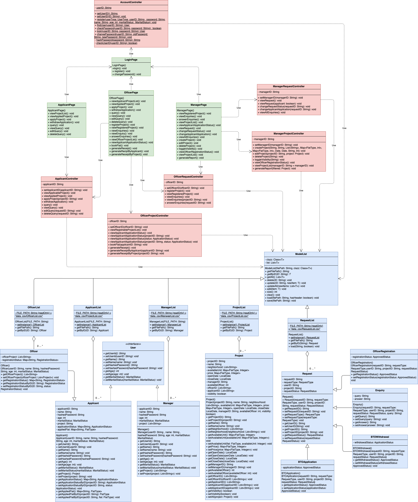
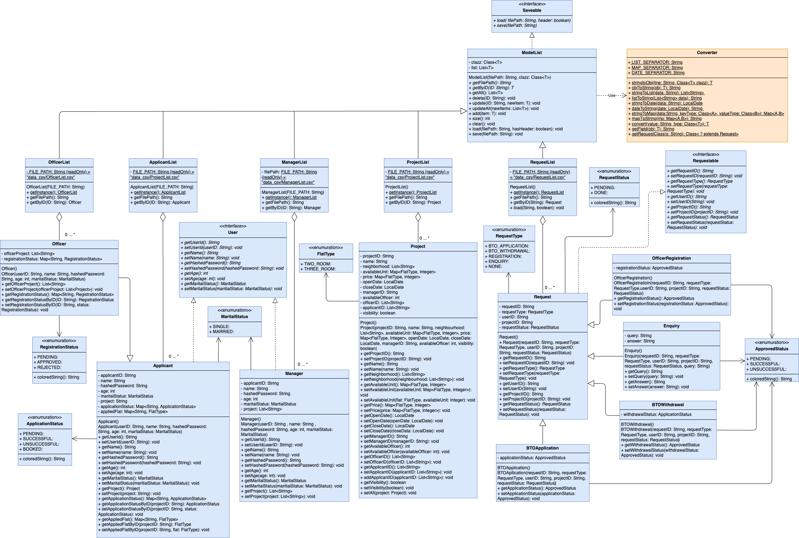
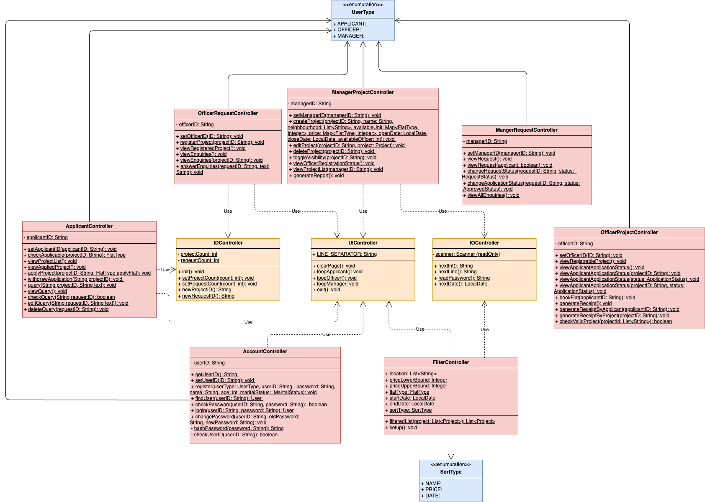
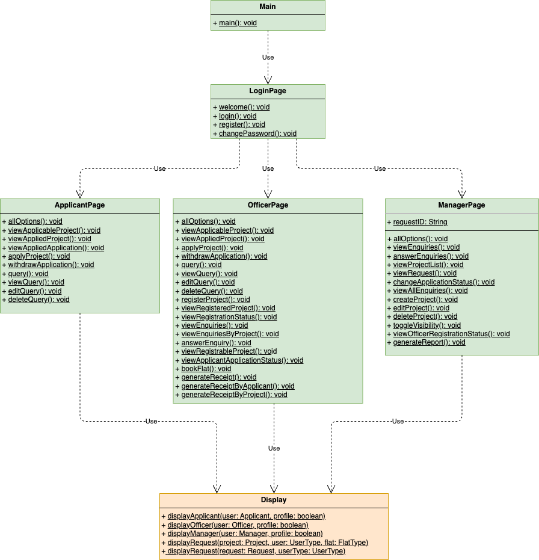
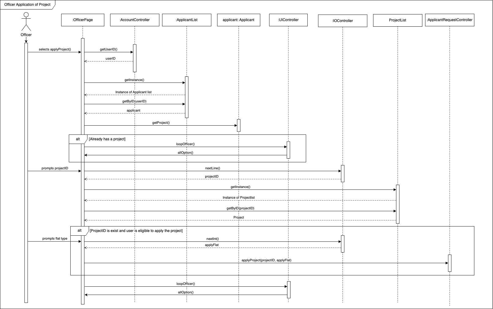
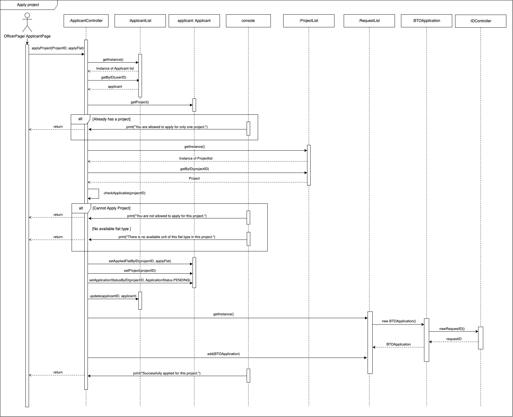
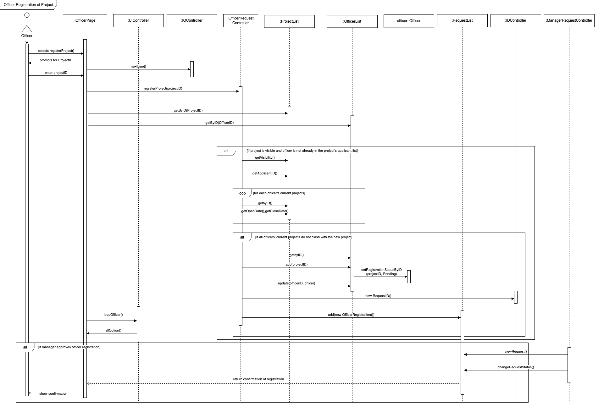

> You can access the PDF version [here](/uml/pdf/)

# Class Diagram

## Main Diagram

## Entity Diagram

## Controller Diagram

## Boundary Diagram

# Sequence Diagram

## Officer Application of Project

## Apply Project

The sequence diagram we've created illustrates the process of an HDB Officer applying for a BTO project. This diagram was selected because it demonstrates a crucial workflow in our system that highlights the inheritance relationship between Officer and Applicant classes, showcasing how our design enables an Officer to perform actions as an Applicant.

### Officer BTO Application Process Flow
The diagram begins with the Officer initiating the application process by selecting the applyProject() option in the OfficerPage. This boundary class then interacts with the UIController, which manages the general user interface operations. The UIController initiates the project selection workflow by calling next() to prepare for input, prompting the user for a project ID, and returning the selected project ID to the OfficerPage.

From there, the interaction flows to the IOController, which handles input and output operations. The IOController retrieves the project by ID from the ProjectList model class. Once the project is obtained, the system continues the application flow by prompting the user to select a flat type and capturing this selection through the IOController.

With both the project ID and flat type selected, the OfficerPage calls the ApplicantController's applyProject() method with these parameters. This demonstrates the polymorphic behavior in our system, as the Officer is treated as an Applicant during this process. The ApplicantController then retrieves the current user profile by calling getById() on the ApplicantList.
The sequence includes two critical validation steps highlighted in the diagram. First, the system checks if the Officer has already applied for a BTO project, preventing duplicate applications. Second, it verifies the Officer's eligibility and the availability of the selected flat type within the project.

If the validations pass, the system proceeds to create a new application by generating a request ID through the utils.IDController, creating a new BTOApplication object, and adding it to the RequestList. The RequestList confirms the successful addition, and the success message propagates back through the controller layers to the OfficerPage.

The diagram concludes with the OfficerPage displaying the success message to the Officer and providing navigation options to return to the main menu or select other actions.

### Design Insights
This sequence diagram reveals several important aspects of our system's design:
The clear separation of concerns between boundary classes (OfficerPage), controllers (UIController, IOController, ApplicantController), and model classes (ProjectList, ApplicantList, RequestList, BTOApplication) demonstrates our adherence to the Model-View-Controller architecture pattern.

The validation steps embedded in the process highlight how our system enforces business rules to maintain data integrity and prevent invalid operations, such as duplicate applications or applications for unavailable flat types.

The interaction between different controller classes shows how we've distributed responsibilities to create a modular and maintainable system. Each controller handles specific aspects of the application process: UIController manages user interface flow, IOController handles input/output operations, and ApplicantController implements the business logic for applications.

The creation and storage of the BTOApplication object illustrates our approach to persisting application data, maintaining a record of all applications in the system through the RequestList.

Overall, this sequence diagram provides valuable insight into how our object-oriented design principles translate into a practical workflow, demonstrating the interaction between multiple system components to fulfill a key user requirement: allowing Officers to apply for BTO projects.

## Officer Registration of Project

### Officer Project Registration Process Flow
The officer project registration process begins when an officer selects the “register project” in the user interface. The IOController uses nextLine() that waits for the user input for a projectID, which is then relayed through the system that reads the user input. The IOController invokes the registerProject(projectID) method within the OfficerRequestController.

At this point, the system retrieves the officer’s unique ID and the project details from the OfficerList and ProjectList, respectively. Before continuing, the system performs an initial validation to determine whether the selected project is visible and whether the officer is not already included in the project’s list of applicants. This is achieved by calling methods such as getVisibility() to view ProjectList and getApplicantID() to view the OfficerID.

Once these conditions are met, the system enters a loop to compare the new project’s schedule with the officer’s existing list of projects. It iterates through each project the officer is already involved in, retrieving the relevant project details using getByID(), getOpenDate(), and getCloseDate(). The system then checks whether the new project’s timeline conflicts with any ongoing or upcoming projects.

If the officer’s current projects end before the new one begins, or the new one ends before the current one starts, the registration can continue. If this scheduling condition is satisfied, the system proceeds to associate the officer with the project by updating their profile and project participation records using methods like setOfficerProject(), setRegistrationStatusByPID(), and update().

A new registration request is created and submitted to the manager for review and approval. This request is handled through the RequestList and is identified with a unique ID generated by the IDController. The ManagerRequestController then retrieves which the Manager can view using viewRequest() and if the registration is approved, it updates the request status using changeRequestStatus() methods.The system sends a confirmation back to the OfficerPage, and the officer is notified that the registration has been successfully completed. 

### Design Insights
Using modular components such as UIController, IOController, OfficerRequestController, and ManagerRequestController, this demonstrates a clear separation of concerns and allows for easier maintenance and future scalability without modifying too much of the main code. The centralized logic handled by the OfficerRequestController ensures consistency across different user interfaces.

There is also the use of validation that ensures that officers can only register for visible projects and are not already listed as applicants.Additionally, the system prevents scheduling overlaps by iterating through the officer’s current projects to check for conflicts. Control structures like alt and loop fragments are effectively used to represent conditional flows and iterative checks, modeling real-world decision-making accurately.

Feedback mechanisms are also well-integrated, with the system returning a confirmation to the officer upon successful registration, enhancing the user experience. Overall, the design promotes a robust, maintainable, and extensible system that can adapt to additional features in the future while ensuring the reliability of the project registration process.

